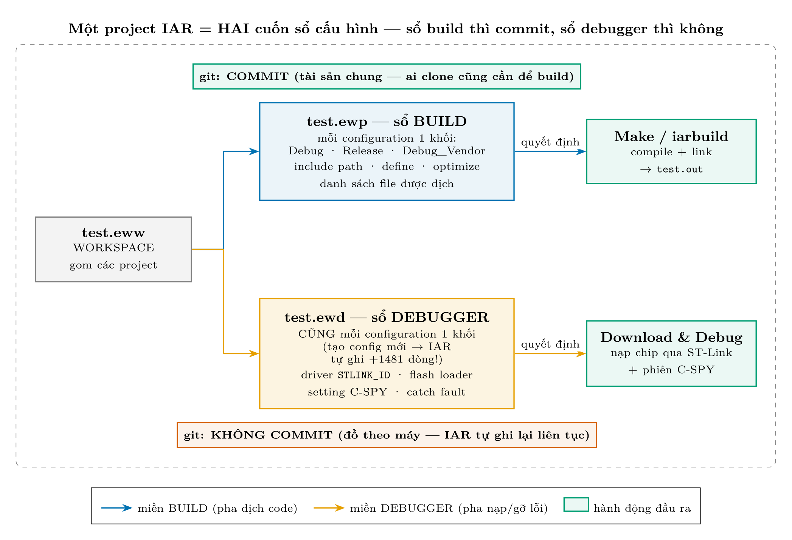

# Giải thích chi tiết: `test.ewp` vs `test.ewd` — vì sao một cái commit, một cái không

> Sinh ra từ câu hỏi thật trong phiên Buổi 12.0: *"file test.ewd bị IAR đụng,
> để nguyên không commit — ủa cái này là sao?"* Entry KB tương ứng:
> `docs/detected-issues/.../toolchain-iar/KI-IAR-0006__ewd-debugger-file-churn-vs-ewp/`.

## 1. Một project IAR trên đĩa không phải MỘT file

Khi bạn bấm "Save" trong IAR, nó rải cấu hình ra **nhiều file cùng tên, khác
đuôi**, mỗi file một vai:

| File | Vai | Ai cần nó | Git |
|---|---|---|---|
| `test.eww` | **workspace** — gom các project, nhớ project nào đang active | người mở IDE | commit (ít khi đổi) |
| `test.ewp` | **sổ BUILD** — include path, define, optimize, file nào được dịch, theo TỪNG configuration | **ai muốn build** (kể cả `iarbuild` CLI, kể cả người clone repo) | ✅ **COMMIT** |
| `test.ewd` | **sổ DEBUGGER** — driver nạp (ST-Link), flash loader, setting C-SPY, catch fault… cũng theo từng configuration | chỉ phiên Download & Debug **trên máy này** | ❌ **KHÔNG commit** |
| `test.ewt` | setting C-STAT/C-RUN (phân tích tĩnh) | hiếm khi đụng | không commit |



## 2. Chuyện gì đã xảy ra hôm tạo `Debug_Vendor`

Bạn tạo config mới bằng GUI (`Project > Edit Configurations… > New…`). IAR
lập tức ghi **HAI nơi**: khối build vào `.ewp` (chủ đích của ta) **và nhân bản
nguyên một khối debugger vào `.ewd`** — vì mỗi configuration phải có setting
C-SPY riêng. Bằng chứng git nguyên văn (đầy đủ trong `error.log` của KI-IAR-0006):

```text
$ git status --short
 M C&C++/.../test_lib/stm32f103c8t6/test.ewd

$ git diff --stat -- .../test.ewd
 .../test.ewd | 1481 ++++++++++++++++++++
 1 file changed, 1481 insertions(+)

$ git diff -- .../test.ewd   (trích đầu khối IAR tự ghi)
+    <configuration>
+        <name>Debug_Vendor</name>
+        ...
+        <settings>
+            <name>C-SPY</name>
```

**+1.481 dòng mà không ai gõ một ký tự nào** — đó là IAR "thay mặt bạn" viết
sổ debugger cho config mới.

## 3. Soi ruột hai cuốn sổ — snippet THẬT từ project này

**`test.ewp` (sổ build)** — đúng chỗ ta thêm đường dẫn kho vendor hôm smoke-test;
đây là thứ người clone repo cần để build được, nên phải commit:

```xml
<option>
    <name>CCIncludePath2</name>
    <state>D:\libraries\C&C++\...\stm32f10x\test_lib\stm32f103c8t6\include</state>
    ...
    <state>D:\libraries\Manufacturer_Package\No.0_C&C++_Industrial_Draft\...\driver\include</state>
    <state>D:\libraries\Manufacturer_Package\STM32CubeF1\Drivers\CMSIS\Include</state>
</option>
```

**`test.ewd` (sổ debugger)** — toàn chuyện "cắm máy nạp trên máy NÀY":

```xml
<option>
    <name>OCDynDriverList</name>
    <state>STLINK_ID</state>              <!-- dùng probe ST-Link -->
</option>
<option>
    <name>FlashLoadersV3</name>
    <state>$TOOLKIT_DIR$\config\flashloader\ST\FlashSTM32F10xx8.board</state>
</option>                                 <!-- nạp flash bằng loader nào -->
```

Nhìn hai snippet là thấy ngay ranh giới: một bên là **tri thức build ai cũng
cần**, một bên là **thói quen nạp chip của riêng máy này** (probe nào, đường
dẫn `$TOOLKIT_DIR$` của bản IAR cài trên máy…).

## 4. Vì sao KHÔNG commit `.ewd`?

1. **Nó là đồ theo máy:** máy khác có thể dùng J-Link thay ST-Link, IAR bản
   khác, đường dẫn khác — commit lên là ép config của máy mình vào máy người khác.
2. **IAR tự ghi lại nó liên tục** — gần như mỗi lần mở/đóng IDE. Commit nó là
   git history đầy rác "đổi 3 dòng setting C-SPY".
3. **Không ảnh hưởng build:** `iarbuild test.ewp -build Debug` không cần `.ewd`
   — bằng chứng: mọi lần build CLI trong dự án này đều chạy khi `.ewd` đang
   modified.

Vì thế từ §6 (Buổi 11) dự án chốt: `.ewd` không commit, và AI bị cấm sửa tay
file này (cùng danh sách `.eww`, device/linker option).

## 5. Chữ "M" cạnh test.ewd làm bạn khó chịu? Hai lựa chọn

- **Kệ nó** (mặc định hiện tại) — vô hại, chỉ là git tường thuật sự thật.
- **Ẩn hẳn:** bảo git đừng nhìn file này nữa:

```bash
git update-index --skip-worktree "C&C++/.../test_lib/stm32f103c8t6/test.ewd"
# đổi ý thì gỡ:
git update-index --no-skip-worktree <đường dẫn đó>
```

(Không dùng `.gitignore` được — file đã tracked từ trước; ignore chỉ có tác
dụng với file CHƯA tracked.)

## 6. Bài học khái quát (mang theo khi đổi IDE)

Mọi IDE đều có ranh giới này dưới dạng nào đó: **cấu hình-tài-sản-chung**
(build) và **cấu hình-theo-máy** (debugger/probe/cửa sổ). Keil tách `.uvprojx`
vs `.uvoptx`; VS Code tách `settings.json` (repo) vs user-settings; CMake tách
`CMakeLists.txt` vs thư mục `build/`. Câu hỏi vạn năng trước khi commit một
file IDE lạ: *"file này chứa tri thức ai-cũng-cần, hay thói quen của máy tôi?"*
