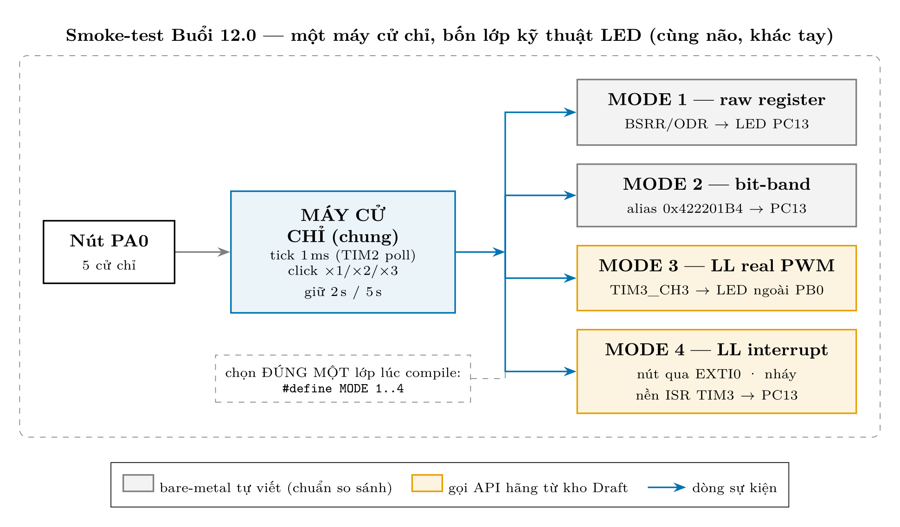
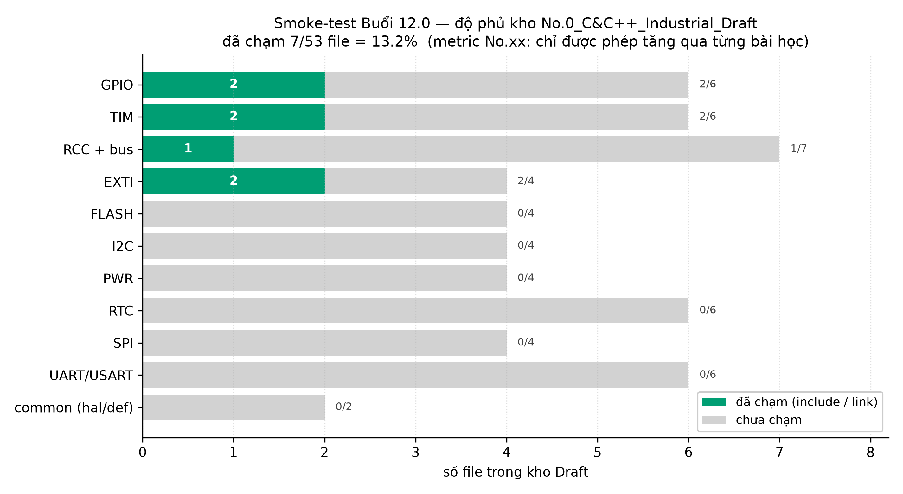

# Buổi 12.0 — Smoke-test kho `No.0_C&C++_Industrial_Draft`: nháy LED, 4 kỹ thuật × 5 cử chỉ

Mục đích: **kiểm tra package rút ruột compile/link/chạy được thật**. `MODE` =
**kỹ thuật điều khiển LED**; mode nào cũng phải phục vụ đủ **5 cử chỉ nút PA0**
giống nhau (board thật đấu nút ở PA0). Đổi `#define MODE` đầu file rồi build lại.
Firmware có **heartbeat 3 nhịp lúc boot** — nạp xong mà không thấy 3 nhịp nghĩa
là core/clock có vấn đề, khỏi nghi oan cho nút.

## 0. Hai khái niệm cần nắm trước

**"Build configuration" trong IAR là gì?** Một project IAR có thể chứa nhiều
"bộ cấu hình build" — mỗi bộ là MỘT bản ghi riêng của toàn bộ Options (include
path, defined symbols, optimize, file nào được build…). Bạn đã dùng nó hàng
ngày mà không để ý: chữ **Debug** trên combo-box đầu cửa sổ Workspace chính là
tên config đang chọn. `Project > Edit Configurations… > New…` tạo thêm một bộ
mới; "base = Debug" nghĩa là chép toàn bộ setting từ Debug ra làm điểm xuất
phát. Ta tạo config tên `Debug_Vendor`: **cùng source, hai bộ luật build** —
chọn `Debug` là build thuần bare-metal như cũ, chọn `Debug_Vendor` là có thêm
đường include + file của hãng. Đổi qua lại chỉ là một cú click combo-box.

**"NO HAL / NO LL" nghĩa là gì?** Là luật số 1 của repo này (AGENTS.md):
firmware chính trong `C&C++/` chỉ được viết bằng **thanh ghi raw**, cấm dùng
hai thư viện của ST: **HAL** (Hardware Abstraction Layer — thư viện cấp cao,
có state machine, callback, timeout) và **LL** (Low-Layer — thư viện mỏng, mỗi
hàm gần như tương ứng 1 thao tác thanh ghi). Mục đích: học thanh ghi thật thay
vì gọi hộp đen. Kho `No.0_..._Draft` là NGOẠI LỆ có kiểm soát để học hai-track,
và config `Debug_Vendor` chính là hàng rào: config `Debug` mặc định không nhìn
thấy một file vendor nào, nên luật cũ không thể bị vi phạm do sơ ý.

**Cả cây tầng API — dòng STM32 nào có tầng nào?** HAL/LL chỉ là 2 nấc giữa;
xếp đủ từ đất lên trời (kho `STM32CubeF1\` clone về chứa trọn cây này):

| Tầng (thấp → cao) | Ai cung cấp | Dòng STM32 hỗ trợ | Vai trong dự án |
|---|---|---|---|
| Thanh ghi raw | — (chính silicon) | **TẤT CẢ** | track A — luật NO HAL/NO LL |
| CMSIS | ARM + ST | **TẤT CẢ** | "từ điển": tên thanh ghi (`TIM2->CR1`), `NVIC_EnableIRQ`, startup — không phải driver |
| SPL *(khai tử ~2014)* | ST | chỉ đời cũ: F0/F1/F2/F3/F4/L1 | thư viện TIỀN NHIỆM của HAL — biết để khỏi lạc khi đọc tutorial/code cổ |
| **LL** | ST | hầu hết các dòng có gói Cube (F0/F1/F3/F4/F7/L0/L1/L4/G0/G4/H7/WB/U5…; riêng F2 không đủ bộ) | track B Buổi 12.0 — mỏng, 1:1 thanh ghi, không cần `hal_conf` |
| **HAL** | ST | **TẤT CẢ** các dòng (mọi gói STM32Cube) | tầng của tutorial/CubeMX — cấp 3 roadmap sẽ so với FSM tự viết |
| Middleware | ST + bên thứ ba | tùy gói Cube từng dòng | USB stack, FatFs, FreeRTOS, LwIP (`Middlewares\` trong kho) — cấp 4–5 |

Đọc bảng theo chiều dọc là thấy chiến lược học: đi từ đáy (đang ở đây) leo dần
lên, mỗi tầng đều có sẵn trong kho — không phải cài thêm gì.

## 1. Bảng MODE (kỹ thuật) — mode nào cũng đủ 5 cử chỉ

| MODE | Kỹ thuật | LED dùng | Gọi gì của Draft |
|---|---|---|---|
| 1 | bare-metal: thanh ghi raw (BSRR/ODR) | PC13 onboard | không — làm CHUẨN so sánh |
| 2 | bare-metal + **bit-band alias** cho mọi thao tác LED | PC13 onboard | không — chuẩn so sánh #2 |
| 3 | **real PWM** phần cứng, API hãng (LL_TIM_OC_*) | ⚠️ **PB0 = TIM3_CH3, LED ngoài** | `ll_tim.c/.h`, `ll_gpio.c/.h`, `ll_bus.h` |
| 4 | **interrupt**: nút qua **EXTI**, nháy qua ngắt TIM3 | PC13 onboard | thêm `ll_exti.c/.h` |

⚠️ Vì sao MODE 3 không dùng PC13: real PWM = tín hiệu do TIMER phát thẳng ra
chân — mà PC13 **không nối tới kênh timer nào** trong silicon F103. Đây là giới
hạn phần cứng, không phải giới hạn kho. Cắm LED ngoài: `PB0 → trở 220Ω → LED → GND`
(duty cao = sáng). Các mode khác vẫn PC13 onboard (active-LOW).

5 cử chỉ (chung cho mọi MODE):

| Cử chỉ | LED phản ứng |
|---|---|
| single click | toggle on/off |
| double click | sáng dần (~2 s) |
| triple click | tối dần (~2 s) |
| giữ ≥ 2 s (nhả ra) | nháy ĐỀU 250 ms — giữ 2 s lần nữa để tắt |
| giữ ≥ 5 s (nhả ra) | nháy KHÔNG đều (pattern 8 bước) — giữ 5 s lần nữa để tắt |

Kiến trúc code: **máy nhận cử chỉ dùng chung** (đếm click cửa sổ 400 ms, đo
thời gian giữ, tick 1 ms từ TIM2 poll) + **lớp LED thay theo MODE** — nhờ vậy
so sánh 4 kỹ thuật là công bằng: cùng não, khác tay.



## 2. Luật biên & các PHÁT HIỆN của phép thử

| Thứ | Nguồn | Ghi chú |
|---|---|---|
| API vendor được gọi (MODE 3/4) | chỉ từ **Draft** | đối tượng của phép thử |
| `stm32f1xx.h`, `core_cm3.h`, startup | kho CMSIS | hạ tầng compile, chưa có counterpart |
| `NVIC_EnableIRQ` (MODE 4) | CMSIS inline | **PHÁT HIỆN #1**: tầng cortex/NVIC chưa có trong Draft |
| `stm32f1xx_hal_conf.h` | không cần | **PHÁT HIỆN #2**: LL thuần né được — sang HAL mới phải tạo |
| bit-band (MODE 2) | không của ai | alias địa chỉ Cortex-M3; vendor không có wrapper — idiom riêng repo gốc |
| SysTick | lõi Cortex-M (CMSIS) | KHÔNG nằm trong `ll_tim`/`hal_tim` — nhóm TIM của chart chỉ là TIM1–4 |

## 3. Config IAR

1. Tạo config: `Project > Edit Configurations… > New…` → Name `Debug_Vendor`,
   "Based on configuration" chọn `Debug` → OK. Trên combo-box Workspace chọn
   `Debug_Vendor`.
2. `Project > Options… > C/C++ Compiler > Preprocessor` (đang đứng ở config
   `Debug_Vendor`). Gốc chung `$REPO$` = `$PROJ_DIR$\..\..\..\..\..\..`:

| # | Include path (nối sau `$REPO$\Manufacturer_Package\`) | Cần cho test? |
|---|---|---|
| 1 | `No.0_C&C++_Industrial_Draft\Embedded_C99\Microcontroller\stm32f10x\driver\include` | ✅ mọi `ll_*.h` |
| 2 | `No.0_C&C++_Industrial_Draft\Embedded_C99\Microcontroller\0_common\include` | ✗ (HAL sau này) |
| 3 | `STM32CubeF1\Drivers\STM32F1xx_HAL_Driver\Inc` | ✗ (HAL sau này) |
| 4 | `STM32CubeF1\Drivers\CMSIS\Device\ST\STM32F1xx\Include` | ✅ `stm32f1xx.h` |
| 5 | `STM32CubeF1\Drivers\CMSIS\Include` | ✅ `core_cm3.h` |

   Defined symbols (cùng tab): `STM32F103xB` và `USE_FULL_LL_DRIVER`.
3. Add Files (group mới `vendor_ll`, chỉ tồn tại trong build khi ở config
   `Debug_Vendor` — hoặc add chung rồi Exclude khỏi config `Debug`):

| File (trong Draft `\...\stm32f10x\driver\`) | Vì sao |
|---|---|
| `stm32f1xx_ll_gpio.c` | `LL_GPIO_Init`/`LL_GPIO_StructInit` sống trong .c — linker PHẢI thấy file rút ruột |
| `stm32f1xx_ll_tim.c` | `LL_TIM_Init`/`LL_TIM_OC_Init` (real PWM MODE 3) |
| `stm32f1xx_ll_exti.c` | `LL_EXTI_Init` (MODE 4) |

4. Swap main sang `main_buoi12_0_test.c` (1 dòng test.ewp như Buổi 11, hoặc
   exclude main cũ khỏi config `Debug_Vendor`).
5. Build → Download & Debug → thử 5 cử chỉ ở từng MODE.

⚠️ Giả định: clock sau reset = HSI 8 MHz (code không đụng PLL — nếu project đã
lên 72 MHz, nhân các `PSC` với 9); vector table hiện có phải chứa
`TIM3_IRQHandler` và `EXTI0_IRQHandler` (nút PA0 = EXTI line 0; ngắt Buổi 11
chạy được nghĩa là vector table device đã đúng chỗ).

## 4. Code — MỘT nguồn sự thật duy nhất

Code KHÔNG chép vào guide nữa (hai bản sẽ lệch nhau — đã xảy ra một lần với vụ
PB13/PA0). File thật, đã build sạch cả 4 MODE:

`Manufacturer_Package\No.0_C&C++_Industrial_Draft\Embedded_C99\Microcontroller\1_Application\main_buoi12_0_test.c`

(nằm bên cây vendor-track CÓ CHỦ ĐÍCH — file gọi LL không được sống trong
`C&C++\` theo luật NO HAL/NO LL; `test.ewp` chỉ trỏ đường dẫn sang.)

Hai núm chỉnh ở đầu file:

```c
#define MODE 4            /* 1 raw | 2 bit-band | 3 real-PWM PB0 | 4 interrupt */
#define BTN_ACTIVE_LOW 1  /* 1: nut PA0 noi GND (chip keo pull-up)  - mac dinh
                             0: nut PA0 noi 3V3 (chip keo pull-down)          */
```

Boot xong LED nháy nhanh 3 nhịp (heartbeat) rồi mới vào vòng đợi cử chỉ —
thấy 3 nhịp = core/clock/tick sống, mọi im lặng sau đó là chuyện của nút.

## 5. Chạy thử & kỳ vọng

| Bước | Thao tác | Kỳ vọng | Nếu sai, nghi đầu tiên |
|---|---|---|---|
| 1 | MODE 1, build `Debug_Vendor` | build xanh dù chưa gọi vendor | include path 4/5 (CMSIS) sai |
| 2 | MODE 1: thử đủ 5 cử chỉ | toggle / sáng dần / tối dần / nháy đều / nháy loạn | clock ≠ 8 MHz (mục 3 ⚠️) |
| 3 | MODE 2: lặp lại 5 cử chỉ | hành vi Y HỆT MODE 1 | bit-band addr `0x422201B4` |
| 4 | MODE 3 (LED ngoài PB0): 5 cử chỉ | fade MƯỢT hơn hẳn soft-PWM | quên add `ll_tim.c` → `Li005`; LED không sáng → cực LED/chân PB0 |
| 5 | MODE 4: 5 cử chỉ | như MODE 1 nhưng nút "ăn" qua EXTI, nháy chạy nền bằng ISR | vector `EXTI0_IRQHandler`/`TIM3_IRQHandler`; quên `ll_exti.c` |

Capture bằng chứng: dumpRegs C-SPY (`TIM2/TIM3 CR1·DIER·SR·CCR3`, `GPIOC_ODR`,
`EXTI IMR·PR`, `NVIC ISER0/ISER1`) → `runtime_buoi12_0.log`.

**Bug thật đã gặp trong phép thử này (đã fix + đã log):** lần nạp đầu board im
lặng tuyệt đối — code giả định nút ở **PB13** (theo hồ sơ Buổi 10) trong khi
board thật đấu nút ở **PA0**; kèm lỗi thiết kế: không có đèn báo sống lúc boot
nên không phân biệt được "core chết" với "nút câm". Fix: chuyển 4 MODE về PA0
+ macro `BTN_ACTIVE_LOW` + heartbeat 3 nhịp. Đây là bug **firmware-logic** nên
được ghi bằng bug-logger skill vào `Log-and-Report-writing-tools/logs/bug_log.md`
(local, theo hard rule #5 — KHÔNG vào kho detected-issues public).

## 6. Độ phủ kho rút ruột sau phép thử

File Draft bị đụng (include hoặc link): `ll_bus.h` · `ll_gpio.h/.c` ·
`ll_tim.h/.c` · `ll_exti.h/.c` = **7 / 53 file ≈ 13.2%**. (SysTick không tính
vào nhóm TIM — nó là lõi Cortex-M, sống bên CMSIS; EXTI giờ đã được đụng đúng
như vai trò interrupt của nút nhấn.)


