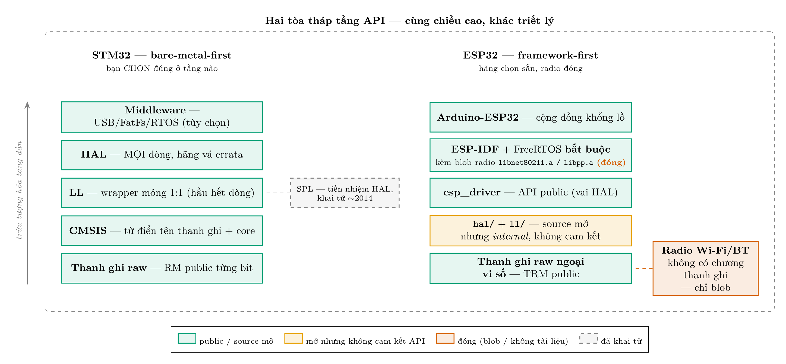

# Báo cáo — Cây tầng API: STM32 vs ESP32, và chiến lược "raw + HAL"

> Xuất xứ: cuộc tranh luận trong phiên smoke-test Buổi 12.0 (2026-07-09), khi
> kho `No.0_C&C++_Industrial_Draft` lần đầu chạy trên board và câu hỏi đặt ra:
> *"thời nay có phải chỉ cần 2 tầng: thanh ghi raw (chính xác tuyệt đối) và
> HAL (nhanh, hãng đã vá lỗi cứng đầu)?"* — cùng câu hỏi nối tiếp về ESP32.
> Bản gốc lưu `docs/datasheets/` (local); bản commit nằm trong
> `Take note quá trình học thanh ghi/Buoi_12.0_test_package_No.0/`.

## 1. Về ý "chỉ cần raw + HAL": đồng ý khoảng 80%, và 20% còn lại nằm ở ba chỗ

1. **Đúng ở bức tranh production:** công nghiệp thực tế ≈ HAL cho tốc độ triển
   khai + errata đã được hãng vá; raw cho độ chính xác tuyệt đối ở chỗ hiểm.
2. **Nhưng hai tầng đó không thay nhau được mà ĐỨNG CHỒNG lên nhau:** khi HAL
   trục trặc (nó CÓ bug riêng + overhead + timeout blocking), người debug được
   là người đọc ra thanh ghi bên dưới. Raw không phải "tầng dùng khi thích
   chính xác" — nó là **điều kiện để dám dùng HAL**. Đây chính là lý do tồn
   tại của lộ trình học hai-track trong repo này.
3. **LL vẫn giữ một ngách dao mổ:** pattern công nghiệp phổ biến là *HAL để
   init* (chạy một lần, không nhạy thời gian) + *LL/raw trong vòng nóng* (ISR,
   datapath) — gọi HAL trong ISR thường quá nặng. Không cần học LL như một
   tầng riêng (nó chỉ là inline wrapper 1:1 thanh ghi), nhưng biết rút ra đúng
   lúc.

## 2. Bảng 1 — Cây tầng STM32 theo dòng chip (chứng minh cho mục 1)

| Tầng (thấp→cao) | F0/F1/F3/F4/F7/H7/G0/G4 (không radio) | WB (BLE) | WL (LoRa) | Ghi chú |
|---|---|---|---|---|
| Thanh ghi raw | ✅ RM public đủ từng bit | ✅ phần MCU | ✅ phần MCU + radio gốc Semtech SX126x có datasheet | độ chính xác tuyệt đối |
| CMSIS | ✅ tất cả | ✅ | ✅ | "từ điển" tên thanh ghi + core, không phải driver |
| SPL *(khai tử ~2014)* | chỉ đời cũ F0/F1/F2/F3/F4/L1 | ❌ | ❌ | tiền nhiệm của HAL — biết để đọc tutorial/code cổ |
| LL | ✅ hầu hết (F2 không đủ bộ) | ✅ | ✅ | mỏng 1:1 thanh ghi, không cần `hal_conf` |
| **HAL** | ✅ **mọi dòng có gói STM32Cube** | ✅ | ✅ | tầng hãng vá errata — tầng của tutorial/CubeMX |
| Middleware | theo gói Cube | + BLE stack (blob!) | + LoRaWAN stack | USB/FatFs/FreeRTOS/lwIP |

⭐ Đọc hàng "raw" và hàng "HAL": đây là **hai tầng duy nhất phủ kín MỌI dòng
STM32** — chiến lược "raw để hiểu + HAL để giao hàng" đứng vững trên toàn dải.

## 3. Bảng 2 — Cây tầng ESP32 theo dòng chip (nền tư duy đọc datasheet Espressif)

| Tầng (thấp→cao) | ESP8266 (2014) | ESP32 (2016) | ESP32-S2/S3 (2020/21) | ESP32-C3/C6 (RISC-V, 2020+) |
|---|---|---|---|---|
| Thanh ghi raw — **ngoại vi số** (GPIO/UART/SPI/timer/DMA…) | TRM mỏng | ✅ TRM ~700tr | ✅ TRM ~1500tr (S3: +USB-OTG, GDMA…) | ✅ TRM |
| Thanh ghi raw — **radio Wi-Fi/BT** | ❌ không có chương thanh ghi | ❌ | ❌ | ❌ |
| Blob radio (`libnet80211.a`, `libpp.a`…) | ✅ bắt buộc | ✅ bắt buộc | ✅ bắt buộc | ✅ bắt buộc |
| `hal/` + `ll/` trong ESP-IDF | (SDK riêng) | ✅ đọc được source nhưng hãng tuyên bố *internal* | ✅ | ✅ |
| `esp_driver` (API public — vai HAL) | RTOS SDK riêng | ✅ | ✅ | ✅ |
| ESP-IDF framework (FreeRTOS BẮT BUỘC + lwIP/NVS/OTA) | ❌ (SDK cũ) | ✅ | ✅ | ✅ |
| Arduino core (cộng đồng khổng lồ) | ✅ core riêng | ✅ | ✅ | ✅ |

⭐ Khác biệt triết lý: **STM32 = bare-metal-first** (bạn chọn tầng);
**ESP32 = framework-first** (mặc định sống trong ESP-IDF/FreeRTOS, tầng thấp
không cam kết, radio là hộp đen). TRM ESP32-S3 KHÔNG phải đồ chơi — nó là tài
liệu thật cho toàn bộ ngoại vi số; chỉ là **không tồn tại chương thanh ghi
radio** trong đó.

## 4. Bảng 3 — Public vs Private: đối chiếu hai hãng

| Khía cạnh | STMicroelectronics | Espressif |
|---|---|---|
| Tài liệu thanh ghi ngoại vi số | ✅ public (RM + errata sheet từng dòng) | ✅ public (TRM từng dòng) |
| Tài liệu thanh ghi radio | (chip thường không có radio) — dòng WB: ❌ | ❌ mọi dòng — nhóm RE xác nhận *"không được tài liệu hóa trong bất kỳ datasheet public nào"* |
| Stack radio | WB: BLE stack = **binary blob** trên core M0+ | Wi-Fi/BT = **binary blob `.a`** trong ESP-IDF |
| Source driver tầng thấp | HAL/LL: ✅ full source (BSD-3, GitHub) | esp_driver + hal/ll: ✅ full source (Apache-2.0, GitHub) |
| Toolchain | compiler xịn truyền thống là hàng thương mại (IAR/Keil); CubeIDE (GCC) miễn phí | ✅ **GCC/Clang mở hoàn toàn**, build system mở |
| ROM bootloader | source ❌, hành vi mô tả trong AN2606 | source ❌ (một phần symbol public) |
| Cộng đồng | STM32duino (Arduino core) — có nhưng nhỏ hơn | **Arduino-ESP32 khổng lồ** — lý do chính ESP32 phủ sóng maker toàn cầu |
| Quy luật chung | **cứ trên die có radio là có phần đóng — bất kể hãng.** Lý do: chứng nhận phát sóng FCC/CE (mở thanh ghi công suất/tần số = user phát sóng sai luật được), IP thiết kế baseband, gánh support | (cùng quy luật) |

Trả lời câu "F1 chỉ ~1000 trang mà đủ hết, sao S3 1500 trang lại thiếu?":
F1 **không có radio trên die** → không có gì phải giấu; S3 có radio → phần đó
không bao giờ vào TRM, dù TRM dày đến đâu.

## 5. Vụ "pro dev can thiệp vào radio ESP32" — CÓ THẬT, hồ sơ chi tiết

**Dự án `esp32-open-mac`** — driver Wi-Fi nguồn mở cho ESP32, dựng bằng
reverse-engineering (không có tài liệu hãng):

| Mốc | Sự kiện |
|---|---|
| ~2023 | Jasper Devreker (nghiên cứu sinh ĐH Ghent, Bỉ) khởi xướng; kỹ thuật chủ lực: **fork trình mô phỏng QEMU** để dò hành vi thanh ghi Wi-Fi |
| 2023-12-08 | CNX-Software đưa tin bài blog đầu tiên *"Unveiling secrets of the ESP32: creating an open-source MAC layer"* |
| 2024-09 | Trình bày tại **RIOT Summit 2024** (hội nghị hệ điều hành nhúng RIOT-OS) |
| 2024-12-27→30 | Talk tại **38C3 — Chaos Communication Congress lần 38, Hamburg** — hội nghị hacker lớn nhất châu Âu (hàng chục nghìn người tham dự); Hackaday tường thuật 2024-12-28 |

**Thành quả tới nay:** gửi/nhận frame Wi-Fi **không cần code độc quyền chạy**
(chỉ khâu khởi tạo phần cứng còn mượn blob); MAC layer tối thiểu scan đủ kênh
và kết nối mạng mở định sẵn. **Giới hạn:** mới chạy trên ESP32 thường (chưa
S2/S3 — địa chỉ ngoại vi Wi-Fi hardcode), chưa production-grade, Bluetooth
chưa đụng.

**Bài học:** "giấu" không ngăn được người giỏi — nhưng cái giá là **nhiều năm
công sức RE** thay vì tra một chương manual. Đó chính là giá trị của phần
public, và là lý do kho detected-issues của repo này gắn trường `scope:` để
bài học mang theo được khi đổi chip.

**Link (đã kiểm chứng 2026-07-09):**
- GitHub: <https://github.com/esp32-open-mac/esp32-open-mac>
- Trang dự án: <https://esp32-open-mac.be/>
- Bài giới thiệu: <https://esp32-open-mac.be/posts/0001-introduction/>
- Hackaday tường thuật 38C3: <https://hackaday.com/2024/12/28/38c3-towards-an-open-wifi-mac-stack-on-esp32/>
- Slide RIOT Summit 2024: <http://summit.riot-os.org/2024/wp-content/uploads/sites/19/2024/09/04-1-Jasper_Devreker.pdf>
- CNX-Software 2023-12-08: <https://www.cnx-software.com/2023/12/08/esp32-open-source-wifi-mac-layer/>
- QEMU fork phục vụ RE: <https://github.com/esp32-open-mac/qemu>

## 6. Kết luận cho dự án này

- Chiến lược **"raw để hiểu + HAL để giao hàng"** đứng vững trên toàn dải
  STM32 (bảng 1) và vẫn đúng tinh thần trên ESP32 — chỉ đổi công thức thành
  **"raw ở phần mở + framework ở phần đóng"** (bảng 2).
- Khi comeback sang **ESP32-S3**: kỹ năng tra TRM cho ngoại vi số dùng lại
  100%; phần radio chấp nhận gọi API ESP-IDF; kho detected-issues lọc
  `scope != mcu-specific` gánh phần kế thừa.
