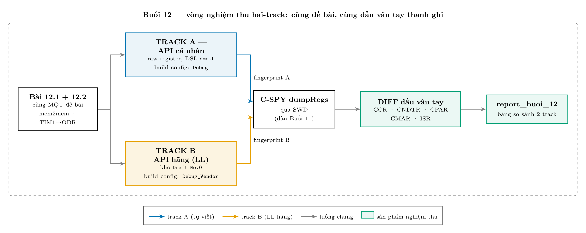

# Buổi 12 — Roadmap DMA: học hai-track (API cá nhân ↔ API hãng)

Bản kế hoạch **trước giờ học**. Kết quả thật của buổi sẽ nằm ở `Note_12.txt` +
snapshot source + `runtime_buoi12.log` như mọi buổi. Bản `.docx` cùng thư mục
là bản trao tay, sinh tự động từ chính file này.

## 1. Mô hình tư duy

- DMA là **băng chuyền**, không phải trợ lý thông minh: nguồn / đích / số lượng /
  cỡ ô phải khai báo trước (`CPAR` / `CMAR` / `CNDTR` / `CCR`) — nó không tự quyết gì.
- DMA đi chung bus AHB với CPU, có arbiter chia lượt — **rẻ chứ không miễn phí**.
- Câu hỏi trung tâm: *"CPU biết việc xong lúc nào?"* — đúng 3 cách:

| Cách | Cơ chế | Trả giá | Dùng khi |
|---|---|---|---|
| Poll cờ `TCIF` | CPU liếc khay định kỳ | vẫn tốn sự chú ý CPU | bài học đầu, việc một-lần |
| Ngắt `TC` qua NVIC | trợ lý gõ cửa **1 lần/lô** | viết ISR + bật ISER | gom lô: 1 ngắt thay N ngắt |
| Circular mode | không bao giờ "xong", buffer luôn tươi | dữ liệu phải chịu bị đè | đo liên tục (ADC…) |

## 2. Vị trí Buổi 12 trong chương DMA (5 cấp)

| Cấp | Nội dung | Buổi | Track hãng |
|---|---|---|---|
| 1 — DMA only | 12.1 mem2mem · 12.2 TIM1_UP→GPIOC_ODR | **Buổi 12** | LL |
| 2 — DMA + interrupt | ngắt TC/HT · gây lỗi TE · arbiter (RM0008 ch.13) | Buổi 13 | LL |
| 3 — API/FSM tự viết | `dma.c/dma.h` · LED-pattern · PWM-wave | Buổi 14 | so với **HAL** |
| 4 — dữ liệu thật | ADC→buf · UART→terminal · MPU6050→OLED | Buổi 15–17 | HAL |
| 5 — lên web | ESP-01 AT / để dành ESP32-S3 | Buổi 18+ | firmware hãng bên ESP |

Kênh DMA1 dùng dọc chương (bảng request là **cứng** — sai kênh = im lặng tuyệt đối):

| Kênh | Request | Phục vụ bài |
|---|---|---|
| CH1 | ADC1 | cấp 4 |
| CH4 | USART1_TX | cấp 4 |
| **CH5** | **TIM1_UP** | **12.2**, 13, 14 |
| CH6 / CH7 | I2C1_TX / I2C1_RX | cấp 4 |

## 3. Track A — giai đoạn API CÁ NHÂN (viết trước)

Mục đích: chạm cốt lõi thanh ghi bằng tay, theo `STANDARD.md` (DSL `RSTRUCT`/`BUNION`).
Diễn ra trong project IAR hiện có, build config `Debug` như cũ — **không đụng gì tới vendor**.

| Việc | Chi tiết |
|---|---|
| File tạo mới | `C&C++\...\stm32f10x\driver\include\dma.h` (register map theo DSL) |
| Code bài học | viết thẳng trong main bài 12 (driver `dma.c` dạng service để dành cấp 3) |
| Build | config `Debug`, `iarbuild` như mọi buổi |
| Bằng chứng | dumpRegs C-SPY: `DMA1_ISR` / `CNDTR` / `CCR`, `GPIOC_ODR`, buffer RAM trước–sau |
| Bug gài | quên `MINC` (8 word đè 1 ô) **hoặc** cấu hình nhầm kênh khác CH5 |

Khung code **12.1 — mem2mem, poll TCIF** (dạng raw cho dễ nhìn; bản thật dùng DSL):

```c
RCC_AHBENR  |= 1UL;                 /* DMA1EN                          */
DMA1_CPAR1   = (unsigned long)src;  /* DIR=0: source = CPAR            */
DMA1_CMAR1   = (unsigned long)dst;  /* destination = CMAR              */
DMA1_CNDTR1  = 8;                   /* watch it count down in C-SPY!   */
DMA1_CCR1    = (1UL<<14)            /* MEM2MEM                         */
             | (2UL<<10)|(2UL<<8)   /* MSIZE = PSIZE = 32-bit          */
             | (1UL<<7) |(1UL<<6);  /* MINC | PINC                     */
DMA1_CCR1   |= 1UL;                 /* EN — starts immediately         */
while (!(DMA1_ISR & (1UL<<1))) {}   /* poll TCIF1                      */
```

Khung **12.2 — TIM1_UP → DMA1_CH5 → GPIOC_ODR** (LED PC13 nháy, `while(1)` trống):

| Thanh ghi | Giá trị | Ý nghĩa |
|---|---|---|
| `TIM1_DIER` | bỏ `UIE` (bit0), bật `UDE` (bit8) | update event → gọi DMA thay vì gọi CPU (xoay đúng **1 bit** so với Buổi 11) |
| `DMA1_CPAR5` | `&GPIOC_ODR` | đích là ngoại vi |
| `DMA1_CMAR5` | mảng `{0x2000, 0x0000}` | pattern bật/tắt PC13 |
| `DMA1_CNDTR5` | 2 | 2 phần tử/vòng |
| `DMA1_CCR5` | `DIR`(bit4) + `CIRC`(bit5) + `MINC` + size 32 + `EN` | memory→peripheral, chạy vĩnh viễn |

Nghiệm thu sướng nhất: đặt breakpoint trong `while(1)` — **CPU đứng im mà LED vẫn nháy**.


## 4. Track B — giai đoạn API HÃNG (cùng buổi, làm sau)

Buổi 12 dùng **LL, chưa dùng HAL** — vì:

- LL là wrapper mỏng, ánh xạ **1:1** với code track A (đọc `stm32f1xx_ll_dma.h`
  sẽ thấy toàn inline function ghi đúng các bit `CCR`/`CNDTR` mình vừa tự set);
- LL **không đòi** `stm32f1xx_hal_conf.h` — HAL đòi; HAL để dành cấp 3, khi FSM
  tự viết ra đời thì so với state machine của HAL mới thấm.

Nghi thức nhập kho (luật `No.0_C&C++_Industrial_Draft`): trong **chính commit
bài học DMA**, `git mv` bộ file hãng từ kho sang Draft — vì counterpart `dma.h`
tự viết đã ra đời:

| File hãng (đang ở `STM32CubeF1\...\STM32F1xx_HAL_Driver\`) | Chuyển tới (Draft `\...\stm32f10x\driver\`) |
|---|---|
| `Src\stm32f1xx_ll_dma.c` | `driver\` |
| `Inc\stm32f1xx_ll_dma.h` | `driver\include\` |
| `Src\stm32f1xx_hal_dma.c` | `driver\` (để sẵn cho cấp 3) |
| `Inc\stm32f1xx_hal_dma.h` | `driver\include\` (để sẵn cho cấp 3) |

Khung code LL tương đương 12.1 — đối chiếu **từng dòng** với track A:

```c
#include "stm32f1xx_ll_bus.h"
#include "stm32f1xx_ll_dma.h"

LL_AHB1_GRP1_EnableClock(LL_AHB1_GRP1_PERIPH_DMA1);
LL_DMA_SetDataTransferDirection(DMA1, LL_DMA_CHANNEL_1,
                                LL_DMA_DIRECTION_MEMORY_TO_MEMORY);
LL_DMA_SetPeriphAddress (DMA1, LL_DMA_CHANNEL_1, (uint32_t)src);
LL_DMA_SetMemoryAddress (DMA1, LL_DMA_CHANNEL_1, (uint32_t)dst);
LL_DMA_SetDataLength    (DMA1, LL_DMA_CHANNEL_1, 8);
LL_DMA_SetPeriphSize    (DMA1, LL_DMA_CHANNEL_1, LL_DMA_PDATAALIGN_WORD);
LL_DMA_SetMemorySize    (DMA1, LL_DMA_CHANNEL_1, LL_DMA_MDATAALIGN_WORD);
LL_DMA_SetPeriphIncMode (DMA1, LL_DMA_CHANNEL_1, LL_DMA_PERIPH_INCREMENT);
LL_DMA_SetMemoryIncMode (DMA1, LL_DMA_CHANNEL_1, LL_DMA_MEMORY_INCREMENT);
LL_DMA_EnableChannel    (DMA1, LL_DMA_CHANNEL_1);
while (!LL_DMA_IsActiveFlag_TC1(DMA1)) {}
```

## 5. Setup & config trong IAR (một lần, cho track B)

**(a) Tạo build config riêng — giữ ranh giới NO HAL/NO LL bằng cấu trúc:**
`Project > Edit Configurations… > New…`, tên **`Debug_Vendor`**, base = `Debug`.
Config `Debug` mặc định **không** có include path vendor → build thường vẫn thuần
bare-metal; bấm chuyển config là đổi track.

**(b) Include path** — chỉ thêm vào config `Debug_Vendor`
(`Options > C/C++ Compiler > Preprocessor > Additional include directories`).
Gốc chung: **`$REPO$` = `$PROJ_DIR$\..\..\..\..\..\..`** (đi lên 6 cấp từ project = `D:\libraries`):

| # | Đường dẫn (nối sau `$REPO$\Manufacturer_Package\`) | Vì sao cần |
|---|---|---|
| 1 | `No.0_C&C++_Industrial_Draft\Embedded_C99\Microcontroller\stm32f10x\driver\include` | header LL/HAL đã nhập kho Draft |
| 2 | `No.0_C&C++_Industrial_Draft\Embedded_C99\Microcontroller\0_common\include` | `stm32f1xx_hal_def.h` (vai `common.h`) |
| 3 | `STM32CubeF1\Drivers\STM32F1xx_HAL_Driver\Inc` | `Legacy\stm32_hal_legacy.h` + `hal_conf` template (đo thật: `hal_def.h` dòng 30 gọi `Legacy/...`) |
| 4 | `STM32CubeF1\Drivers\CMSIS\Device\ST\STM32F1xx\Include` | `stm32f1xx.h`, `stm32f103xb.h` (đo thật: `hal_def.h` dòng 29) |
| 5 | `STM32CubeF1\Drivers\CMSIS\Include` | `core_cm3.h` — tầng lõi Cortex-M |

Lưu ý: thêm bằng **GUI** cho lành (GUI tự escape); sửa `.ewp` bằng tay thì ký tự
`&` trong `C&C++` phải ghi `&amp;` (file .ewp là XML).

**(c) Defined symbols** (cùng tab Preprocessor, config `Debug_Vendor`):

| Symbol | Vai trò |
|---|---|
| `STM32F103xB` | chọn device trong `stm32f1xx.h` |
| `USE_FULL_LL_DRIVER` | mở API LL đầy đủ |

**(d) Add Files** — đăng ký source vào project; *include path KHÔNG thay được
bước này*, thiếu là `Error[Li005]: undefined external`:

| Track | File phải add | Ghi chú |
|---|---|---|
| LL (Buổi 12) | *thường không cần file nào* | đa số API LL là inline trong header; chỉ add `stm32f1xx_ll_dma.c` nếu dùng bộ `LL_DMA_Init()` struct-style |
| HAL (cấp 3) | `stm32f1xx_hal.c` + `hal_cortex.c` (còn ở kho) + `hal_rcc.c` + `hal_dma.c` | kèm việc **tạo `stm32f1xx_hal_conf.h`** từ `*_conf_template.h`, bật đúng các `HAL_..._MODULE_ENABLED` — file config này là CỦA MÌNH |

**(e) Download & Debug:** không đổi gì — `.ewd` / ST-Link / flash giữ nguyên;
dumpRegs C-SPY dùng chung cho cả hai track.

## 6. Nghiệm thu hai track — "cùng dấu vân tay thanh ghi"



| Bước | Việc |
|---|---|
| 1 | chạy track A → dumpRegs → fingerprint A (`CCR` / `CNDTR` / `CPAR` / `CMAR` / `ISR`) |
| 2 | chạy track B → dumpRegs → fingerprint B |
| 3 | **diff**: hai bản phải để lại CÙNG giá trị thanh ghi |
| 4 | chỗ hãng set khác mình = bài học (default nào an toàn hơn? chặn erratum gì?) → ghi vào report |

Sản phẩm chốt buổi (Definition of Done — `docs/platform-v2.md` mục 3.1):
`Note_12.txt` (user duyệt trước commit) + snapshot `.c.txt` hai track +
`runtime_buoi12.log` + `git mv` bộ DMA vào Draft + `report_buoi_12.md` có bảng
so sánh hai track (số dòng / dễ đọc / xử lý lỗi / footprint).
