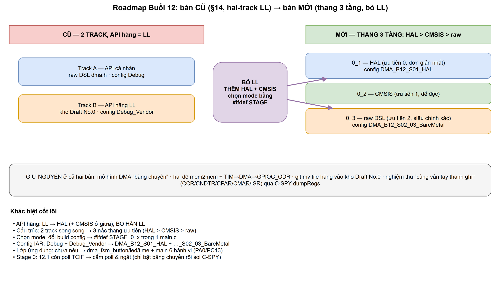
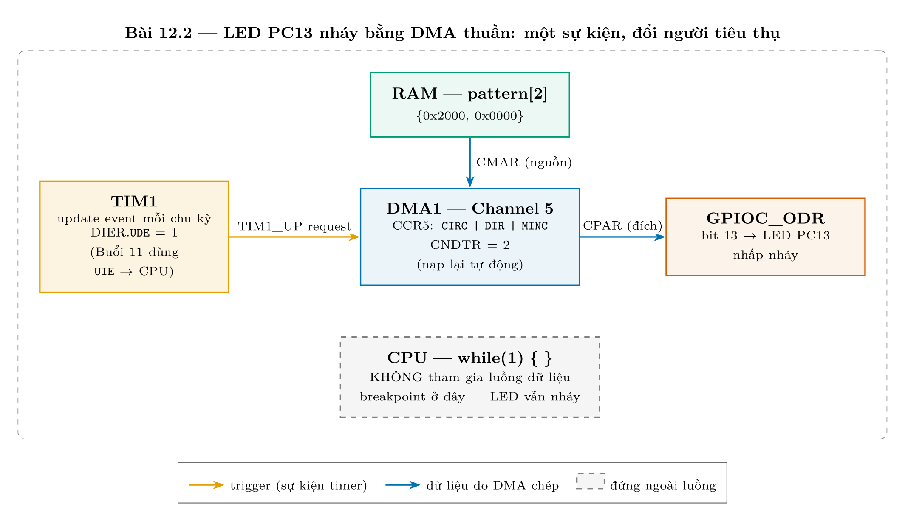

# Báo cáo: Roadmap Buổi 12 — so sánh bản CŨ (§14) và bản MỚI

> So sánh hai phiên bản kế hoạch học DMA của Buổi 12: bản **cũ** (commit §14, thiết
> kế "hai-track" dùng **LL**) và bản **mới** (viết lại trong phiên này, "thang 3 tầng
> API" **bỏ LL**). Hai hình cũ được khôi phục để đối chiếu: `assets/old_roadmap_1.png`,
> `assets/old_roadmap_2.png`.

## Mục lục
1. [Bối cảnh — vì sao có hai bản](#1-bối-cảnh--vì-sao-có-hai-bản)
2. [Tổng quan một hình](#2-tổng-quan-một-hình)
3. [Điểm GIỐNG nhau](#3-điểm-giống-nhau)
4. [Điểm KHÁC nhau](#4-điểm-khác-nhau)
5. [Hai hình của roadmap CŨ (đã khôi phục)](#5-hai-hình-của-roadmap-cũ-đã-khôi-phục)
6. [Kết luận — vì sao đổi](#6-kết-luận--vì-sao-đổi)

---

## 1. Bối cảnh — vì sao có hai bản

- **Bản CŨ (§14):** viết *trước* smoke-test. Dựng "track hãng" bằng **LL** vì LL là
  wrapper mỏng, ánh xạ gần **1:1** với thanh ghi, và **không đòi** `stm32f1xx_hal_conf.h`.
  Chia làm **2 track song song**: Track A tự viết (raw DSL) ↔ Track B hãng (LL).
- **Bản MỚI:** sau smoke-test §16 mới thấy giữa HAL và thanh ghi thô còn nhiều tầng,
  và với người mới **LL là thừa**. Nên **bỏ hẳn LL**, thay bằng một **thang ưu tiên
  3 tầng**: HAL (đơn giản nhất) → CMSIS (dễ đọc) → raw DSL (siêu chính xác).

## 2. Tổng quan một hình

## 3. Điểm GIỐNG nhau

Hai bản chia sẻ phần "xương sống" — điều này cho thấy việc viết lại là **đổi cách tiếp
cận API**, không phải đổi bản chất bài học:

| # | Giữ nguyên ở cả hai bản |
|---|---|
| 1 | Mô hình tư duy: **DMA là "băng chuyền"** — khai báo nguồn/đích/số lượng/cỡ ô (`CPAR`/`CMAR`/`CNDTR`/`CCR`) trước, không tự quyết |
| 2 | Hai đề DMA: **mem2mem** (RAM→RAM) và **TIM → DMA → `GPIOC_ODR`** (LED PC13 nháy, CPU đứng ngoài) |
| 3 | Pattern LED `{0x2000, 0x0000}` nạp vòng (circular) vào `ODR` |
| 4 | Nghi thức "rút ruột" file hãng: **`git mv`** từ kho `STM32CubeF1` sang `No.0_...Draft` ngay trong commit bài học |
| 5 | Nghiệm thu bằng **"cùng vân tay thanh ghi"**: C-SPY `dumpRegs` đọc `CCR/CNDTR/CPAR/CMAR/ISR` rồi **diff** |
| 6 | Bằng chứng phần cứng đi qua `runtime_buoi12.log` (không tin trí nhớ) |

## 4. Điểm KHÁC nhau

| Khía cạnh | Bản CŨ (§14) | Bản MỚI |
|---|---|---|
| **API hãng** | **LL** | **HAL** (+ **CMSIS** ở giữa) — **bỏ hẳn LL** |
| **Cấu trúc** | 2 track song song (cá nhân ↔ hãng) | **3 nấc thang ưu tiên** HAL > CMSIS > raw |
| **Chọn mode** | đổi **build config** | **`#ifdef STAGE_0_x`** trong **một** `main.c` |
| **Config IAR** | `Debug` + `Debug_Vendor` | `DMA_B12_S01_HAL` + `DMA_B12_S02_03_BareMetal` |
| **Kênh minh hoạ** | CH5 (TIM1_UP) cho LED | CH1 mem2mem (Đề A) + TIM→DMA (Đề B) |
| **Lớp ứng dụng** | chưa nêu chi tiết | `dma_fsm_button/led/time` + `main` **6 hành vi** (PA0/PC13) |
| **Stage 0** | 12.1 **còn poll** `TCIF` | **cấm poll & ngắt** — chỉ bật băng chuyền rồi soi C-SPY |

## 5. Hai hình của roadmap CŨ (đã khôi phục)

Hai hình này thuộc bản §14, nay khôi phục vào `assets/` với tiền tố `old_` để lưu vết:

> Ghi chú: hai hình cũ vẽ theo **CH5/TIM1_UP** và **hai-track LL**. Bản mới thay bằng
> **thang 3 tầng** (xem Hình 1) và tách hẳn Đề A (mem2mem, CH1) khỏi Đề B.

## 6. Kết luận — vì sao đổi

Bản mới **không phủ nhận** bản cũ; nó **nâng cấp trục sư phạm**:

- **Bỏ LL** vì nó nằm lưng chừng — người mới không học thêm được gì so với việc đi
  thẳng từ **HAL** (cho nhanh) xuống **CMSIS/raw** (cho hiểu tới bit).
- **Thang 3 tầng + `#ifdef STAGE`** cho phép **cùng một đề** chạy qua 3 cách gõ và
  chứng minh chúng để lại **cùng vân tay thanh ghi** — đúng mục tiêu "hiểu tới tận
  thanh ghi, không bị khoá vào thư viện hãng".
- Thêm **lớp ứng dụng** (`dma_fsm_*` + 6 hành vi) để bài học DMA gắn với sản phẩm
  thật (nút PA0 điều khiển LED PC13), thay vì chỉ dừng ở mức thanh ghi.
